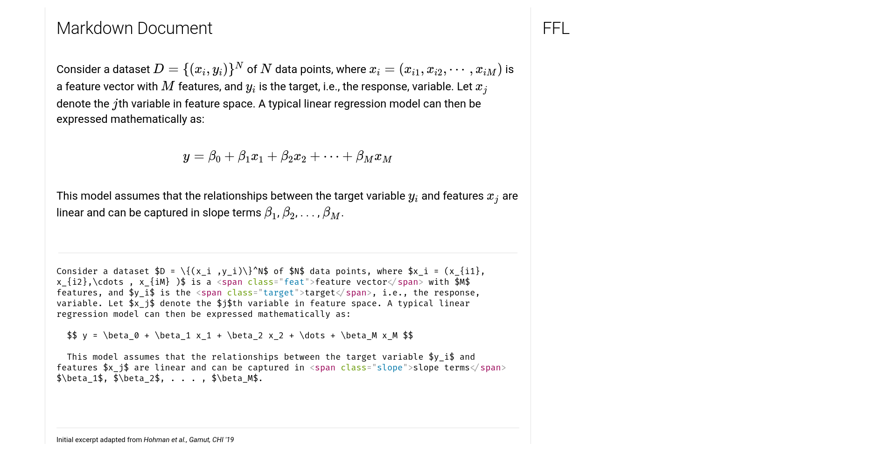

### FFL - Formula Formatting Language
FFL is a CSS-like language that allows you to style LaTeX-typeset formula in a web environment. 

#### How to Use
Check out our [Getting Started Guide](https://penn-hci.github.io/ffl/getting-started).

#### How to Run

##### Integrated Demo
We periodically update our [hosted demo](https://penn-hci.github.io/ffl/demo). To run this locally,
1. `npm install` in this directory
2. `cd site/md-playground-vite` into the main demo environment with markdown integration
3. `npm install` && `npm run dev`

If all steps here are successful, you should see a react page pop up which you can experiment with.

On the right side under "FFL" you will be able to enter FFL stylings.

> An old version of the demo also exists at `site/md-playground-webpack` which is no longer maintained as of React 18.2.

##### Core Library
The root directory of this repo is the root directory of this project. It only contains the parsing and rendering of FFL and nothing on the editing environment. In [`ffl.ts`](ffl.ts#320) you will find `render` and `renderToHTML` which emulate `KaTeX`, which are the main entry points for calling FFL on single formulas. An example integration can be seen in [`markdown-it-ffl`](https://github.com/wu000168/markdown-it-ffl) which calls FFL to work with the `markdown-it` engine.

#### How to Contribute
The project is still in its early stages and there are major changes incoming to the implementation. If you have ideas, submit an issue in the repo. If you want to get involved, get in touch with the authors of the project and we will try our best to help get you onboard. As this project matures, this process will likely also evolve and change.
